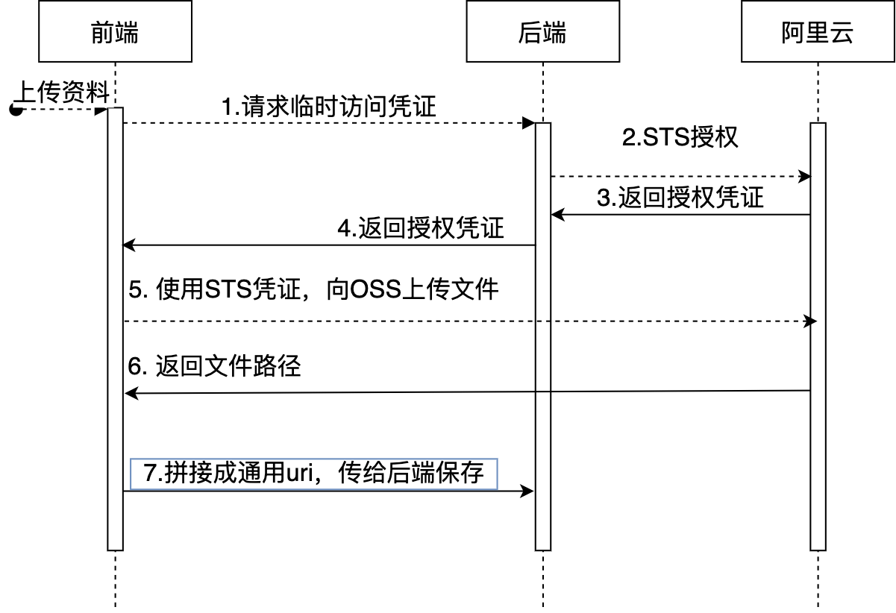
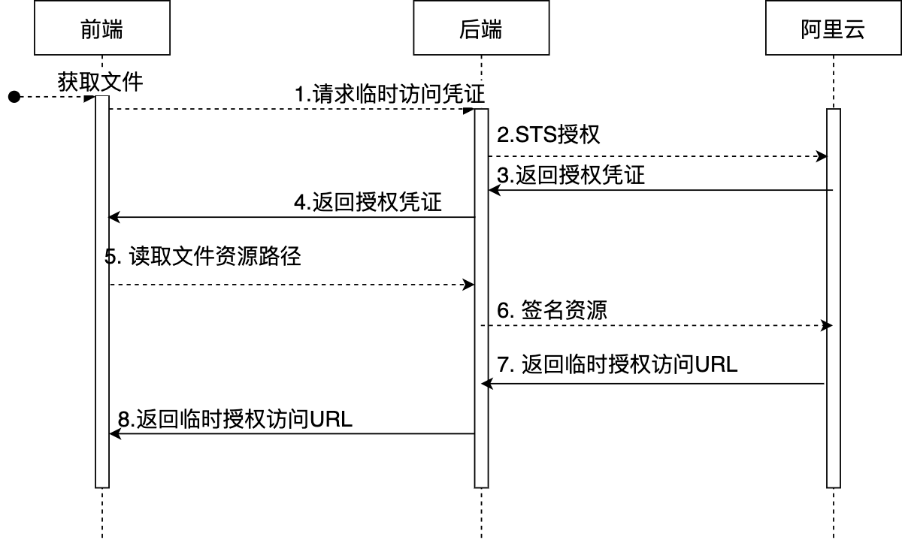

# 对象存取流程设计(以ali-oss为例)
## 主要需求：
1. 前后端统一文件存取方式，解决不同开发小组协作上不统一的方式，以及重复开发工作。
2. 易扩展，支持混合云平台，如七牛-OSS、AWS-S3等。
3. 考虑私有读和公有读的处理，防止开发存放私有读的http链接，或者直接存放bucket的原始http链接。

## 解决方案:
### 资源路径设计：
#### 通过设计url scheme的方式，保存图片资源路径，不直接使用http链接存储。
```
  [bucket-name]:/[full path in buckert]
```
**比如在阿里云中：**
```
  my-oss-bucket:/assets/demo/index.png
  └──────┬─────┘└──────────┬─────────┘
       bucket     文件在bucket下的路径
```

### 上传资源




### 读取资源
可以将my-oss-bucket:替换为对应的回源域名，

如https://my-oss-bucket.domain.com

完整资源访问路径：https://my-oss-bucket.domain.com/assets/demo/index.png

### 读取private权限资源

不使用http链接访问资源，改为采用通用uri设计，可防止不了解OSS的开发将http私有读链接直接落库。




## 补充内容：OSS资源访问授权
### 方式一：CDN访问控制
https://help.aliyun.com/document_detail/43229.html

### 方式二：OSS访问控制，以浏览器和NodeJS的SDK为例
https://help.aliyun.com/document_detail/64040.html
NodeJS:https://help.aliyun.com/document_detail/32067.html


